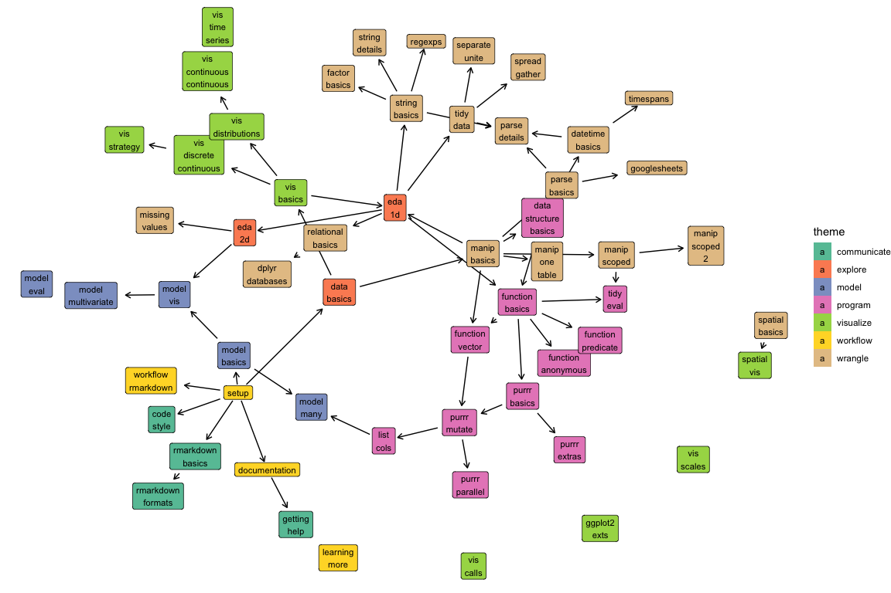

# Data Challenge Lab

[](http://creativecommons.org/licenses/by-nc/4.0/)

This repository contains the draft curriculum for the Stanford [Data Challenge Lab](https://datalab.stanford.edu/challenge-lab).

The curriculum is composed of small __units__ and bigger __challenges__. A unit is a set of guided readings and a handful of low-level exercises (in an `.Rmd`) designed to test that you've understood the material. Challenges are integrative tasks that may take several hours to complete and are contextualised with real data problems. (In terms of Bloom's taxonomy, exercises tend be remember/understand/apply, and challenges are analyse/evaluate/create.) 

The units and challenges will be composed in several ways. So far, we have focused on a __[curriculum](https://dcl-2018-04.github.io/curriculum/)__, a temporal ordering of unit designed to lay out the material into a 5-credit, 10-week course. Challenges are currently private; you must be enrolled in the course to see them.

## Overview



## Structure

There are two key elements to the structure of the site: `syllabus.yml` and the `units` directory. 

### `syllabus.yml`

`syllabus.yml` has two elements:

* `cur-week`, the current week of the course, used to control what units are
  shown on the index page. This will need to be updated once per week.
  
* `weeks`, a list of the unit names, which defines the structure of the course.

### `units/`

The `units/` directory contains the information each individual unit. A unit can either be a `.yml` file or a `.Rmd` file. Use a `.yml` file if the unit links primarily to other readings; use `.Rmd` if the reading contains new content or you want to use R code. A `.yml` is created for `.Rmd`, so make sure you are editing the right file, or your changes will be overwritten the next time you modify the site.

Both `.Rmd` and `.yml` have three key metadata elements:

* `title`: a brief human-readable description of the unit

* `theme`: the major them to which the unit belongs

* `needs`: an array of units which should be taken prior to this unit. This
  is used to generate the overview graph, and cross-links between units.

```yaml
title: Data basics
theme: explore
needs: [setup]
```

`.yml` units also require a `desc`ription. This should be written in markdown and I recommend using the yaml `|` formatting helper which will preserve whitespace in the output file.

```yaml
desc: |
  Exploratory data analysis is partly a set of techniques, but is mostly a
  mindset: you want to remain open to what the data is telling you.
```

(The `.yml` files generated from `.Rmd` files will have a `desc` field that contains the result of rendering the `.Rmd`)

Both `.yml` and `.Rmd` files can include `readings`. These come in two basics forms: either a reading from one of the predefined `book`, or a link to a website. You can optionally include the `author` name for websites, and either form can have an additional `desc`ription. A few examples are listed below:

```yaml
readings:
- book: r4ds-7.5

- href: http://rmarkdown.rstudio.com/developer_parameterized_reports.html
  text: Parameterized reports

- href: https://github.com/jennybc/reprex#what-is-a-reprex
  text: What is a reprex?
  author: Jenny Bryan
  desc: Some general advice on writing reprexes

- book: r4ds-12.5
  desc: >
    (explicit vs implicit).
    We haven't covered the vocabulary of "tidy data" yet, but be aware that
    different ways of organisation the same data may make explicit missing
    values that were previously implicit in the data.
```

## Build process

If you are using RStudio, press `Cmd + Shift + B` to rebuild the site. Alternatively, execute `scripts/build.R` by hand. To make the build process as speedy as possible, files are only updated if the input file is more recent than the output file.

The repository is structured as a package, so you can use `devtools::load_all()` to make all functions available for interactive use. The one function that you may want to use (and isn't exposed any other way) is `clean()`: it deletes all rendered documents from `docs/` so you can rebuild the site from scratch.
