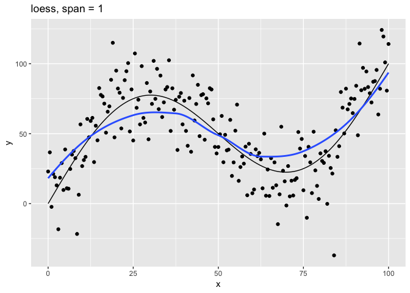
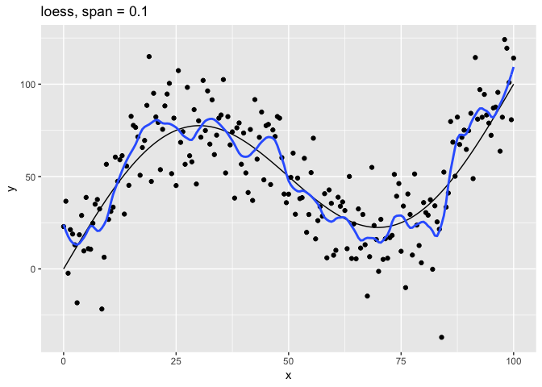
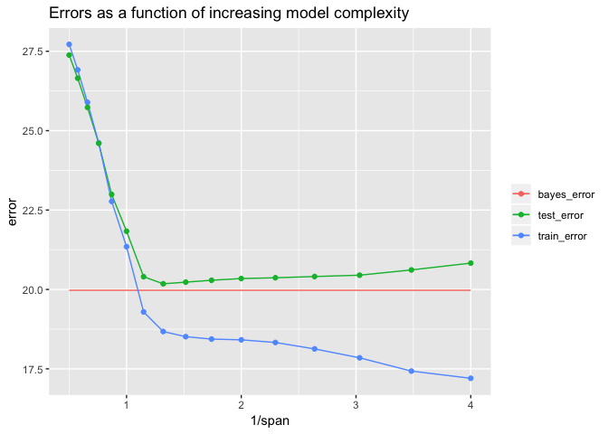
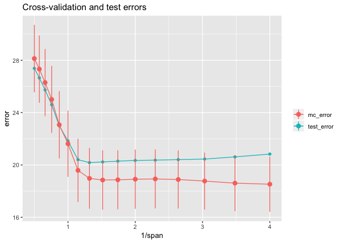

<!-- Generated automatically from model-eval.yml. Do not edit by hand -->

# Model evaluation <small class='model'>[model]</small>
<small>(Builds on: [Models with multiple variables](model-multivariate.md))</small>


``` r
library(tidyverse)
library(modelr)
```

How do you know if a model is any good? How do you measure the quality of a model? We will explore these questions below.

The problem
-----------

Let's assume that we are trying to develop a model of a phenomenon that has a functional representation of the form

*y* = *f*(*x*)

and that any measurements of *y* have errors. We typically would not know *f* -- that's why we are developing a model -- but for our purposes we will specify *f* and some simulated data.

``` r
# True function
f <- function(x) x + 50 * sin(pi / 50 * x)

# Function with measurement error
g <- function(x) f(x) + rnorm(n = length(x), mean = 0, sd = 20)

# Random sample of data points
sim_data <- function(from, to, by) {
  tibble(
    x = seq(from = from, to = to, by = by),
    y = g(x)
  )
}
```

Let's generate a random sample that we'll use for our modeling below.

``` r
set.seed(439)

data_1 <- sim_data(0, 100, 0.5)
```

Here's a plot of the true function with the data we will use to model it.

``` r
tibble(x = seq(0, 100, 0.5), y = f(x)) %>% 
  ggplot(aes(x, y)) +
  geom_line() +
  geom_point(data = data_1) +
  labs(title = "True function and data to model it with")
```


The `loess()` model
-------------------

Given the shape of our data, we will try to model it using the `stats::loess()` function. This function works by creating local models at each point, where each local model only uses data within a given distance from the point. The function has the parameter `span` to control which data points are included in the local models; the smaller the span, the fewer points included in the local models.

Let's look at the relationship of the `span` parameter to the resulting model.

``` r
# Plot loess model for given span
plot_loess <- function(span) {
  data_1 %>% 
    mutate(f = f(x)) %>% 
    add_predictions(loess(y ~ x, data = data_1, span = span)) %>% 
    ggplot(aes(x)) +
    geom_line(aes(y = f)) +
    geom_point(aes(y = y)) +
    geom_line(aes(y = pred), color = "#3366FF", size = 1) +
    labs(
      title = str_c("loess, span = ", span),
      y = "y"
    )
}
```

``` r
c(10, 1, 0.75, 0.1, 0.01) %>% 
  walk(~ print(plot_loess(.)))
```



The `span` parameter clearly makes a big difference in the model:

-   `span = 10` is has too much smoothing, washing out the variablity in the model.
-   `span = 1` is much better, but still has a bit too much smoothing.
-   `span = 0.75` is the default and does a reasonably good job.
-   `span = 0.1` has too little smoothing. The added complexity of the model is now fitting the random variation.
-   `span = 0.01` has gone way too far, fitting individual random points.

The models with `span` equal to `0.1` and `0.01` have **overfit** the data. Models that have been overfit will not generalize; that is, they will not work well with new data.

Test and training errors
------------------------

Let's return to the question of how to measure the quality of a model. Above we could visualize the models because they were very simple, with only one predictor variable `x`. It is harder to visualize models with many predictor variables.

One idea for measuring the quality of a model would be to compare its predicted values with actual values in the data. Ideally, we want to know the difference between predicted and actual values on *new* data. This is called the **test error**. Unfortunately, we usually don't have new data. All we have is the data used to create the model. The difference between the predicted and actual values on the data used to train the model is called the **training error**.

Since the expected value for the error term of `g()` is `0` for each `x`, the best possible model for new data would be `f()` itself. The error on `f()` itself is called the **Bayes error**.

Usually, we don't know the underlying function `f()`, and we don't have new data. In our case since our data is simulated, we know `f()`, and we can generate new data. Below we will generate a dataset `data_50` that has 50 samplings of the size of `data_1` to get an accurate measure of the test error.

How do we measure the difference between a vector of predictions and a vector of actual values? Two common ways include:

-   Root-mean-square error (RMSE): `sqrt(mean((y - pred)^2, na.rm = TRUE))`
-   Mean absolute error (MAE): `mean(abs(y - pred), na.rm = TRUE)`

Both measures are supported by modelr. We'll use RMSE below.

Let's begin by generating new dataset for testing with 50 times as much data as our original dataset.

``` r
set.seed(886)

data_50 <- 
  1:50 %>% 
  map_dfr(~ sim_data(0, 100, 0.5))
```

We will now train a series of models on the original dataset `data_1` using a range of `span`s. For each model, we will calculate the training error on `data_1` and the test error on the new data `data_50`.

``` r
spans <- 2^seq(1, -2, -0.2)

errors <- 
  tibble(span = spans) %>% 
  mutate(
    train_error =
      map_dbl(span, ~ rmse(loess(y ~ x, data = data_1, span = .), data_1)),
    test_error =
      map_dbl(span, ~ rmse(loess(y ~ x, data = data_1, span = .), data_50))
  )
```

The Bayes error calculated from `data_50` is:

``` r
bayes_error <- 
  data_50 %>% 
  summarize(bayes_error = sqrt(mean((y - f(x))^2, na.rm = TRUE))) %>% 
  pull(bayes_error)
```

Let's plot the errors.

``` r
bayes <- tibble(
  span = range(errors$span),
  type = "bayes_error",
  error = bayes_error
)

errors %>% 
  gather(key = type, value = error, -span) %>% 
  ggplot(aes(1 / span, error, color = type)) + 
  geom_line(data = bayes) +
  geom_line() +
  geom_point() +
  labs(
    title = "Errors as a function of increasing model complexity",
    color = NULL
  )
```



The models get more complex as `span` gets smaller. We have plotted the errors as a function of 1 / `span`, so the larger values on the right indicate more complex models. The Bayes error should be 20, the standard deviation of measurement error in `g()`. The lowest value of test error was approximately 20.18 -- very close to the Bayes error. This was achieved for `span` ≈ 0.758, which is close to the default `span` = 0.75 used by `loess()`.

Notice from the plot that as the model gets more and more complex, the training error continues to decline but after a point the test error starts to increase. This divergence means that the model overfits the training data for small span values.

Here we were able to generate new data (`data_50`) to calculate the actual test error. However, we typically will only have the original data (`data_1`), and getting new data will not be option. Therefore, it is important to be able to estimate the test error well. Since complex models can overfit the training data, as shown above, the training error is is not a good estimate of the test error, and it is *not* a good idea to use the training error to make decisions about the best model. In the next section, we will discuss better ways to estimate the test error from the original data.

Cross-validation
----------------

The key idea of cross-validation is that in the absence of new data, we can hold out a portion of the original data, train the model on the rest of the data, and then test the model the portion that was held out. modelr provides two functions for generating train-test pairs:

-   `crossv_mc()`: Generates `n` random partitions, holding out a specified proportion of the data to test with.
-   `crossv_kfold()`: Splits the data into `k` exclusive partitions or folds. It uses each of the `k` folds as a test set with the remaining `k` - 1 folds as the training set.

Let's see how these functions work.

``` r
df <- 
  data_1 %>% 
  crossv_kfold(k = 10)

df
```

    ## # A tibble: 10 x 3
    ##    train          test           .id  
    ##    <list>         <list>         <chr>
    ##  1 <S3: resample> <S3: resample> 01   
    ##  2 <S3: resample> <S3: resample> 02   
    ##  3 <S3: resample> <S3: resample> 03   
    ##  4 <S3: resample> <S3: resample> 04   
    ##  5 <S3: resample> <S3: resample> 05   
    ##  6 <S3: resample> <S3: resample> 06   
    ##  7 <S3: resample> <S3: resample> 07   
    ##  8 <S3: resample> <S3: resample> 08   
    ##  9 <S3: resample> <S3: resample> 09   
    ## 10 <S3: resample> <S3: resample> 10

In this case, `crossv_kfold()` creates 10 train-test pairs in two list-columns `train` and `test`. These variables are lists of resample objects.

Let's look at the resample objects for a train-test pair.

``` r
glimpse(df$train[[1]])
```

    ## List of 2
    ##  $ data:Classes 'tbl_df', 'tbl' and 'data.frame':    201 obs. of  2 variables:
    ##   ..$ x: num [1:201] 0 0.5 1 1.5 2 2.5 3 3.5 4 4.5 ...
    ##   ..$ y: num [1:201] 22.95 36.64 -2.32 21.26 18.88 ...
    ##  $ idx : int [1:180] 1 2 3 4 5 6 8 9 10 11 ...
    ##  - attr(*, "class")= chr "resample"

``` r
glimpse(df$test[[1]])
```

    ## List of 2
    ##  $ data:Classes 'tbl_df', 'tbl' and 'data.frame':    201 obs. of  2 variables:
    ##   ..$ x: num [1:201] 0 0.5 1 1.5 2 2.5 3 3.5 4 4.5 ...
    ##   ..$ y: num [1:201] 22.95 36.64 -2.32 21.26 18.88 ...
    ##  $ idx : int [1:21] 7 15 31 45 51 58 65 73 77 89 ...
    ##  - attr(*, "class")= chr "resample"

A resample object consists of the original dataset together with a set of indices that indicate the subset of the original data to use.

From the index variables `idx`, we can see that the train and test sets are disjoint and their union is the complete original dataset.

``` r
is_empty(intersect(df$train[[1]]$idx, df$test[[1]]$idx))
```

    ## [1] TRUE

``` r
setequal(union(df$train[[1]]$idx, df$test[[1]]$idx), 1:201)
```

    ## [1] TRUE

Some model functions, such as `lm()` can take as input resample objects. `loess()` does not, however. For models such as these, you can turn a resample object into the corresponding tibble using `as_tibble()`.

``` r
as_tibble(df$test[[1]])
```

    ## # A tibble: 21 x 2
    ##        x     y
    ##    <dbl> <dbl>
    ##  1   3   -18.3
    ##  2   7    35.0
    ##  3  15    82.6
    ##  4  22    75.6
    ##  5  25    45.1
    ##  6  28.5  58.0
    ##  7  32    96.4
    ##  8  36    51.9
    ##  9  38    38.3
    ## 10  44    84.9
    ## # ... with 11 more rows

Resample objects are quite wasteful of space, since each one contains the full dataset. A new package [rsample](https://topepo.github.io/rsample/) is being developed to support tidy modeling in a much more space-efficient way.

With `crossv_mc()`, you can independently specify the number of train-test pairs and the proportion of the data to hold out to test with. With `crossv_kfold()` the parameter `k` specifies the number of train-test pairs and the proportion, `1 / k`, of data to hold out to test with. To get more pairs with `crossv_kfold()` you can simply repeat it.

The following function returns the RMSE for a given span, train data, and test data.

``` r
rmse_error <- function(span, train, test) {
  rmse(loess(y ~ x, data = as_tibble(train), span = span), as_tibble(test))
}
```

The following function that calculates the errors for a given span on all of the train-test pairs in a given CV set, and then calculates the mean and standard deviation of the errors.

``` r
span_error <- function(span, data_cv) {
  errors <- 
    data_cv %>% 
    select(-.id) %>% 
    add_column(span = span) %>% 
    pmap_dbl(rmse_error)
  
  tibble(
    span = span,
    error_mean = mean(errors, rm = TRUE),
    error_sd = sd(errors, na.rm = TRUE)
  )
}
```

Next, let's use `crossv_mc()` to generate 100 train-test pairs with test sets consisting of approximately 20% of the data. We will then calculate the CV error for all `span`s using these train-test pairs.

``` r
set.seed(430)

data_mc <- crossv_mc(data_1, n = 100, test = 0.2)

errors_mc <- 
  spans %>% 
  map_dfr(~ span_error(span = ., data_cv = data_mc))

errors_mc %>% 
  knitr::kable()
```

|       span|  error\_mean|  error\_sd|
|----------:|------------:|----------:|
|  2.0000000|     28.13057|   2.578456|
|  1.7411011|     27.32540|   2.572414|
|  1.5157166|     26.29811|   2.566547|
|  1.3195079|     25.00708|   2.558990|
|  1.1486984|     23.06875|   2.568471|
|  1.0000000|     21.62002|   2.532316|
|  0.8705506|     19.58527|   2.417289|
|  0.7578583|     18.97282|   2.323062|
|  0.6597540|     18.84846|   2.269925|
|  0.5743492|     18.86447|   2.256472|
|  0.5000000|     18.90930|   2.260496|
|  0.4352753|     18.93128|   2.254325|
|  0.3789291|     18.88556|   2.220315|
|  0.3298770|     18.76699|   2.171678|
|  0.2871746|     18.60700|   2.135667|
|  0.2500000|     18.52702|   2.109205|

Let's compare the CV estimates of the test error with the actual test error.

``` r
errors_mc %>% 
  left_join(errors, by = "span") %>% 
  ggplot(aes(1 / span)) +
  geom_line(aes(y = test_error, color = "test_error")) +
  geom_point(aes(y = test_error, color = "test_error")) +
  geom_line(aes(y = error_mean, color = "mc_error")) +
  geom_pointrange(
    aes(
      y = error_mean, 
      ymin = error_mean - error_sd,
      ymax = error_mean + error_sd,
      color = "mc_error"
    )
  ) +
  labs(
    title = "Cross-validation and test errors",
    y = "error",
    color = NULL
  )
```



From this plot, we can see that CV error estimates from `crossv_mc()` underestimate the true test error in the range with 1 / `span` &gt;= 1. The results with `crossv_kfold()` are similar. The line ranges reflect one standard error on either side of the mean error and show that there is considerable uncertainty in the error estimates. Except for the largest 1 / `span` = 4, the test error is within one standard error of the mean.

Typically we will only know the CV errors. Here's the rule of thumb for choosing a tuning parameter knowing only the CV errors:

-   Start with the parameter that has the lowest mean CV error. In this case, that would be `span` = 0.25.
-   Imagine first horizontally sliding the one-standard-error range for `span` = 0.25 all the way to the left of the plot, and then sliding it to the right, stoping when the first CV mean error is within this range. In our case, the top of the one-standard-error range for `span` = 0.25 is approximately 20.6. The CV mean error for `span` = 1 is larger than this, but the next most complex model with `span` ≈ 0.871 is smaller, so we would choose this `span`.

We saw above that if we knew the test error, we would choose `span` ≈ 0.758 as the optimal parameter. But we usually don't know the test error, and in this case the test errors for 0.871 and 0.758 were very close, with both quite close to the Bayes error of 20.

``` r
errors %>% 
  filter(span < 0.9, span > 0.7) %>% 
  select(span, test_error) %>% 
  knitr::kable()
```

|       span|  test\_error|
|----------:|------------:|
|  0.8705506|      20.4014|
|  0.7578583|      20.1787|

