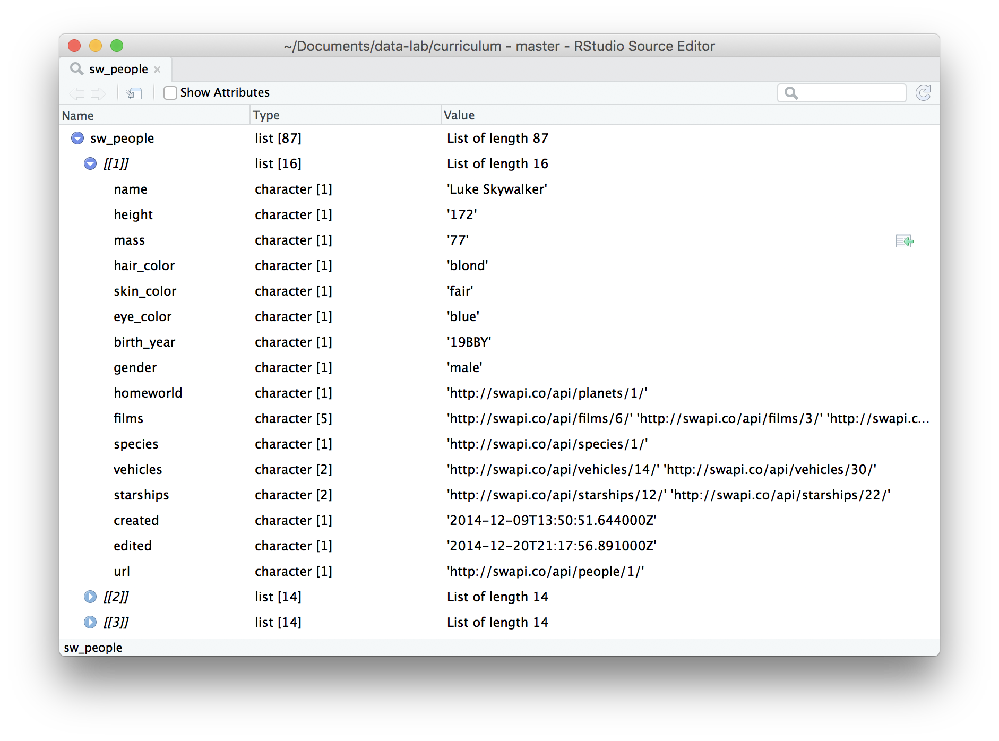

<!-- Generated automatically from purrr-map.yml. Do not edit by hand -->

# Iteration basics <small class='program'>[program]</small>
<small>(Builds on: [Data structure basics](data-structure-basics.md))</small>  
<small>(Leads to: [Purrr map variants](purrr-map-variants.md))</small>


## Introduction

One of the biggest advantage to using a programming langauge rather than
a point-and-click GUI is that you can automate repetitive tasks. In this
lesson, you’ll the learn basics of the purrr package in order to repeat
a task across multiple elements of a vector. We’ll also use the
repurrrsive package, which contains some interesting data sets.

``` r
library(purrr)
library(repurrrsive)
```

This lesson was adapted from “[An introduction to
purrr](https://github.com/cwickham/purrr-tutorial)” by Charlotte
Wickham.

## Star Wars

To illustrate purrr we’re going to use `repurrrsive::starwars`, which
contains data about characters in the Star Wars movies. The data is
contained in a data structure that we haven’t talk about yet: a list.
Lists are a step up in complexity from atomic vectors, because lists can
contain other lists. This makes them suitable for representing
hierarchical or tree-like structures.

``` r
typeof(sw_people)
#> [1] "list"
length(sw_people)
#> [1] 87
```

The best to interactively explore a complex list is with `View()` in
RStudio.

<!-- -->

Failing that, it’s often possible to extract out the first element with
`x[[1]]`, then use `str()` on that:

``` r
luke <- sw_people[[1]]
str(luke)
#> List of 16
#>  $ name      : chr "Luke Skywalker"
#>  $ height    : chr "172"
#>  $ mass      : chr "77"
#>  $ hair_color: chr "blond"
#>  $ skin_color: chr "fair"
#>  $ eye_color : chr "blue"
#>  $ birth_year: chr "19BBY"
#>  $ gender    : chr "male"
#>  $ homeworld : chr "http://swapi.co/api/planets/1/"
#>  $ films     : chr [1:5] "http://swapi.co/api/films/6/" "http://swapi.co/api/films/3/" "http://swapi.co/api/films/2/" "http://swapi.co/api/films/1/" ...
#>  $ species   : chr "http://swapi.co/api/species/1/"
#>  $ vehicles  : chr [1:2] "http://swapi.co/api/vehicles/14/" "http://swapi.co/api/vehicles/30/"
#>  $ starships : chr [1:2] "http://swapi.co/api/starships/12/" "http://swapi.co/api/starships/22/"
#>  $ created   : chr "2014-12-09T13:50:51.644000Z"
#>  $ edited    : chr "2014-12-20T21:17:56.891000Z"
#>  $ url       : chr "http://swapi.co/api/people/1/"
```

In this case, each element of the `sw_people` list is another list
containing data about a character.

### `map()` basics

There are lots of questions that are easy to answer if we have one
character, but harder if we have many characters. For example, image we
want to find out how many starships Luke has been on:

``` r
luke[["starships"]]
#> [1] "http://swapi.co/api/starships/12/" "http://swapi.co/api/starships/22/"
length(luke[["starships"]])
#> [1] 2
```

It’s easy to do this for a few individuals:

``` r
leia <- sw_people[[5]]
length(leia[["starships"]])
#> [1] 0
```

But what if you want to do it for all 87 people? Using copy and paste
will be both tedious and error prone.

``` r
length(sw_people[[1]][["starships"]])
#> [1] 2
length(sw_people[[2]][["starships"]])
#> [1] 0
length(sw_people[[3]][["starships"]])
#> [1] 0
# ...
length(sw_people[[87]][["starships"]])
#> [1] 3
```

Instead, we’re going to learn a new approach using `purrr::map()`.
`map()` has two key arguments:

  - `.x`: an atomic vector, list, or data frame to do manipulate.
  - `.f`: the thing to do each element.

There are many ways to specify `.f` which you’ll learn about later. For
now, we’re going to focus on using it with **formulas**, which are
created with `~`. Formulas allow us to extract out a common pattern, or
recipe, from repeated code.

Creating a recipe is easy: take a single solution and put a `~` in front
of it, and replace the part the varies over elements with `.x`, a
pronoun. For example, to find the number of starships for a person, we’d
do:

``` r
~ length(.x$starships)
#> ~length(.x$starships)
#> <environment: 0x7fb6506d9a78>
```

This is a formula. A formula doesn’t do anything; it just captures your
intent. Here `.x` is a pronoun like “it”, `map()` will replace `.x` with
each element of the list in turn. To use formula, we need to apply it to
the `sw_people` list with `map()`:

``` r
ships <- map(sw_people, ~ length(.x$starships))
head(ships)
#> [[1]]
#> [1] 2
#> 
#> [[2]]
#> [1] 0
#> 
#> [[3]]
#> [1] 0
#> 
#> [[4]]
#> [1] 1
#> 
#> [[5]]
#> [1] 0
#> 
#> [[6]]
#> [1] 0
```

Note that the output is quite long so I save it to a variable and then
only look at the first few entries (using the helpful `head()`
function).

This is much easier than copy and pasting\!

## Output type

`map()` always returns a list. This is the most general function because
any R data structure can be stored inside a list. But often you want
something simpler, so you’ll use one of the map variants:

  - `map_lgl()` makes a logical vector.
  - `map_int()` makes an integer vector.
  - `map_dbl()` makes a double vector.
  - `map_chr()` makes a character vector.

Here are a few examples: try and figure out what they do. If you don’t
understand, translate back from the generic formula to a specific
example. For example, you could translate `~ .x[["name"]]` back to
`luke[["name"]]`.

``` r
map_chr(sw_people, ~ .x[["name"]])
#>  [1] "Luke Skywalker"        "C-3PO"                
#>  [3] "R2-D2"                 "Darth Vader"          
#>  [5] "Leia Organa"           "Owen Lars"            
#>  [7] "Beru Whitesun lars"    "R5-D4"                
#>  [9] "Biggs Darklighter"     "Obi-Wan Kenobi"       
#> [11] "Anakin Skywalker"      "Wilhuff Tarkin"       
#> [13] "Chewbacca"             "Han Solo"             
#> [15] "Greedo"                "Jabba Desilijic Tiure"
#> [17] "Wedge Antilles"        "Jek Tono Porkins"     
#> [19] "Yoda"                  "Palpatine"            
#> [21] "Boba Fett"             "IG-88"                
#> [23] "Bossk"                 "Lando Calrissian"     
#> [25] "Lobot"                 "Ackbar"               
#> [27] "Mon Mothma"            "Arvel Crynyd"         
#> [29] "Wicket Systri Warrick" "Nien Nunb"            
#> [31] "Qui-Gon Jinn"          "Nute Gunray"          
#> [33] "Finis Valorum"         "Jar Jar Binks"        
#> [35] "Roos Tarpals"          "Rugor Nass"           
#> [37] "Ric Olié"              "Watto"                
#> [39] "Sebulba"               "Quarsh Panaka"        
#> [41] "Shmi Skywalker"        "Darth Maul"           
#> [43] "Bib Fortuna"           "Ayla Secura"          
#> [45] "Dud Bolt"              "Gasgano"              
#> [47] "Ben Quadinaros"        "Mace Windu"           
#> [49] "Ki-Adi-Mundi"          "Kit Fisto"            
#> [51] "Eeth Koth"             "Adi Gallia"           
#> [53] "Saesee Tiin"           "Yarael Poof"          
#> [55] "Plo Koon"              "Mas Amedda"           
#> [57] "Gregar Typho"          "Cordé"                
#> [59] "Cliegg Lars"           "Poggle the Lesser"    
#> [61] "Luminara Unduli"       "Barriss Offee"        
#> [63] "Dormé"                 "Dooku"                
#> [65] "Bail Prestor Organa"   "Jango Fett"           
#> [67] "Zam Wesell"            "Dexter Jettster"      
#> [69] "Lama Su"               "Taun We"              
#> [71] "Jocasta Nu"            "Ratts Tyerell"        
#> [73] "R4-P17"                "Wat Tambor"           
#> [75] "San Hill"              "Shaak Ti"             
#> [77] "Grievous"              "Tarfful"              
#> [79] "Raymus Antilles"       "Sly Moore"            
#> [81] "Tion Medon"            "Finn"                 
#> [83] "Rey"                   "Poe Dameron"          
#> [85] "BB8"                   "Captain Phasma"       
#> [87] "Padmé Amidala"
map_lgl(sw_people, ~ .x[["gender"]] == "male")
#>  [1]  TRUE FALSE FALSE  TRUE FALSE  TRUE FALSE FALSE  TRUE  TRUE  TRUE
#> [12]  TRUE  TRUE  TRUE  TRUE FALSE  TRUE  TRUE  TRUE  TRUE  TRUE FALSE
#> [23]  TRUE  TRUE  TRUE  TRUE FALSE  TRUE  TRUE  TRUE  TRUE  TRUE  TRUE
#> [34]  TRUE  TRUE  TRUE  TRUE  TRUE  TRUE  TRUE FALSE  TRUE  TRUE FALSE
#> [45]  TRUE  TRUE  TRUE  TRUE  TRUE  TRUE  TRUE FALSE  TRUE  TRUE  TRUE
#> [56]  TRUE  TRUE FALSE  TRUE  TRUE FALSE FALSE FALSE  TRUE  TRUE  TRUE
#> [67] FALSE  TRUE  TRUE FALSE FALSE  TRUE FALSE  TRUE  TRUE FALSE  TRUE
#> [78]  TRUE  TRUE FALSE  TRUE  TRUE FALSE  TRUE FALSE FALSE FALSE
map_int(sw_people, ~ length(.x$starships))
#>  [1] 2 0 0 1 0 0 0 0 1 5 3 0 2 2 0 0 1 1 0 0 1 0 0 1 0 0 0 1 0 1 0 0 0 0 0
#> [36] 0 1 0 0 0 0 1 0 0 0 0 0 0 0 0 0 0 0 0 1 0 1 0 0 0 0 0 0 0 0 0 0 0 0 0
#> [71] 0 0 0 0 0 0 1 0 0 0 0 0 0 1 0 0 3
map_chr(sw_people, ~ .x[["hair_color"]])
#>  [1] "blond"         "n/a"           "n/a"           "none"         
#>  [5] "brown"         "brown, grey"   "brown"         "n/a"          
#>  [9] "black"         "auburn, white" "blond"         "auburn, grey" 
#> [13] "brown"         "brown"         "n/a"           "n/a"          
#> [17] "brown"         "brown"         "white"         "grey"         
#> [21] "black"         "none"          "none"          "black"        
#> [25] "none"          "none"          "auburn"        "brown"        
#> [29] "brown"         "none"          "brown"         "none"         
#> [33] "blond"         "none"          "none"          "none"         
#> [37] "brown"         "black"         "none"          "black"        
#> [41] "black"         "none"          "none"          "none"         
#> [45] "none"          "none"          "none"          "none"         
#> [49] "white"         "none"          "black"         "none"         
#> [53] "none"          "none"          "none"          "none"         
#> [57] "black"         "brown"         "brown"         "none"         
#> [61] "black"         "black"         "brown"         "white"        
#> [65] "black"         "black"         "blonde"        "none"         
#> [69] "none"          "none"          "white"         "none"         
#> [73] "none"          "none"          "none"          "none"         
#> [77] "none"          "brown"         "brown"         "none"         
#> [81] "none"          "black"         "brown"         "brown"        
#> [85] "none"          "unknown"       "brown"
```

The `map_` functions always either give you the type of vector that you
asked for, or they throw an error. Sometimes this reveals surprising
information about your data:

``` r
map_dbl(sw_people, ~ .x[["mass"]])
#> Error: Can't coerce element 1 from a character to a double
```

Why not? Whenever you get an error, a good strategy is to go back to the
basics and look at a single value:

``` r
luke[["mass"]]
#> [1] "77"
```

`mass` has been recorded as a string\! So lets use `map_chr()` to get
it.

``` r
map_chr(sw_people, ~ .x[["mass"]])
#>  [1] "77"      "75"      "32"      "136"     "49"      "120"     "75"     
#>  [8] "32"      "84"      "77"      "84"      "unknown" "112"     "80"     
#> [15] "74"      "1,358"   "77"      "110"     "17"      "75"      "78.2"   
#> [22] "140"     "113"     "79"      "79"      "83"      "unknown" "unknown"
#> [29] "20"      "68"      "89"      "90"      "unknown" "66"      "82"     
#> [36] "unknown" "unknown" "unknown" "40"      "unknown" "unknown" "80"     
#> [43] "unknown" "55"      "45"      "unknown" "65"      "84"      "82"     
#> [50] "87"      "unknown" "50"      "unknown" "unknown" "80"      "unknown"
#> [57] "85"      "unknown" "unknown" "80"      "56.2"    "50"      "unknown"
#> [64] "80"      "unknown" "79"      "55"      "102"     "88"      "unknown"
#> [71] "unknown" "15"      "unknown" "48"      "unknown" "57"      "159"    
#> [78] "136"     "79"      "48"      "80"      "unknown" "unknown" "unknown"
#> [85] "unknown" "unknown" "45"
```

We probably want that as a number so we can use `read::parse_number()`,
and tell it that in this variable missing values are recorded as
“unknown”:

``` r
sw_people %>% 
  map_chr(~ .x[["mass"]]) %>% 
  readr::parse_number(na = "unknown")
#>  [1]   77.0   75.0   32.0  136.0   49.0  120.0   75.0   32.0   84.0   77.0
#> [11]   84.0     NA  112.0   80.0   74.0 1358.0   77.0  110.0   17.0   75.0
#> [21]   78.2  140.0  113.0   79.0   79.0   83.0     NA     NA   20.0   68.0
#> [31]   89.0   90.0     NA   66.0   82.0     NA     NA     NA   40.0     NA
#> [41]     NA   80.0     NA   55.0   45.0     NA   65.0   84.0   82.0   87.0
#> [51]     NA   50.0     NA     NA   80.0     NA   85.0     NA     NA   80.0
#> [61]   56.2   50.0     NA   80.0     NA   79.0   55.0  102.0   88.0     NA
#> [71]     NA   15.0     NA   48.0     NA   57.0  159.0  136.0   79.0   48.0
#> [81]   80.0     NA     NA     NA     NA     NA   45.0
```

## Shortcuts

So far we’ve used a formula recipe for the second argument of `map()`.
But it can be lots of other things. For example, it can also be a string
or integer:

  - `map(.x, .f = "some_name")` is equivalent to `map(.x, ~
    .x[["some_name"]])`
  - `map(.x, .f = some_name)` is equivalent to `map(.x, ~
    .x[[some_name]])`

That lets us simplify some exressions:

``` r
# BEFORE: 
# map_chr(sw_people, ~ .x[["mass"]])

# AFTER
map_chr(sw_people, "mass")
#>  [1] "77"      "75"      "32"      "136"     "49"      "120"     "75"     
#>  [8] "32"      "84"      "77"      "84"      "unknown" "112"     "80"     
#> [15] "74"      "1,358"   "77"      "110"     "17"      "75"      "78.2"   
#> [22] "140"     "113"     "79"      "79"      "83"      "unknown" "unknown"
#> [29] "20"      "68"      "89"      "90"      "unknown" "66"      "82"     
#> [36] "unknown" "unknown" "unknown" "40"      "unknown" "unknown" "80"     
#> [43] "unknown" "55"      "45"      "unknown" "65"      "84"      "82"     
#> [50] "87"      "unknown" "50"      "unknown" "unknown" "80"      "unknown"
#> [57] "85"      "unknown" "unknown" "80"      "56.2"    "50"      "unknown"
#> [64] "80"      "unknown" "79"      "55"      "102"     "88"      "unknown"
#> [71] "unknown" "15"      "unknown" "48"      "unknown" "57"      "159"    
#> [78] "136"     "79"      "48"      "80"      "unknown" "unknown" "unknown"
#> [85] "unknown" "unknown" "45"
```

`.f` can also be a function: `map(.x, .f = some_function, ...)` is
equivalent to `map(.x, .f = ~ some_function(.x, ...))`

``` r
# BEFORE
# map_int(sw_people, ~ length(.x$starships))

sw_people %>%
  map("starships") %>%
  map_int(length)
#>  [1] 2 0 0 1 0 0 0 0 1 5 3 0 2 2 0 0 1 1 0 0 1 0 0 1 0 0 0 1 0 1 0 0 0 0 0
#> [36] 0 1 0 0 0 0 1 0 0 0 0 0 0 0 0 0 0 0 0 1 0 1 0 0 0 0 0 0 0 0 0 0 0 0 0
#> [71] 0 0 0 0 0 0 1 0 0 0 0 0 0 1 0 0 3
```

Generally, I think the “after” form is a little better. It’s usually
easier to solve a problem by taking one small step at a time. Check your
results, then only proceed to the next step if they’re proceed. Each
step becomes one entry in a pipeline. This might lead to a long
pipeline; if you’re worried about that, you can rewrite it for clarity
and concision **after** you have got it working.

