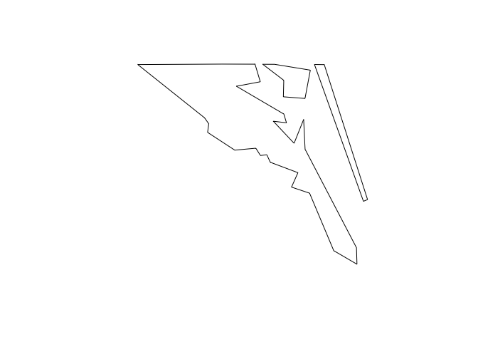

<!-- Generated automatically from spatial-basics.yml. Do not edit by hand -->

# Spatial basics <small class='wrangle'>[wrangle]</small>
<small>(Leads to: [Spatial visualisation](spatial-vis.md))</small>


Spatial packages
----------------

In R, there are two main lineages of tools for dealing with spatial data: sp and sf.

-   sp has been around for a while (the first release was in 2005), and it has a rich ecosystem of tools built on top of it. However, it uses a rather complex data structure, which can make it challenging to use.

-   sf is newer (first released in October 2016!) so it doesn't have such a rich ecosystem. However, it's much easier to use and fits in very naturally with the tidyverse, and the ecosystem around it will grow rapidly.

Loading data
------------

To read spatial data in R, use `read_sf()`. The following example reads an example dataset built into the sf package:

``` r
library(tidyverse)
library(sf)

# The counties of North Carolina
nc <- read_sf(system.file("shape/nc.shp", package = "sf"))
```

Here we're loading from a **shapefile** which is the way spatial data is most commonly stored. Despite the name a shapefile isn't just one file, but is a collection of files that have the same name, but different extensions. Typically you'll have four files:

-   `.shp` contains the geometry, and `.shx` contains an index into that geometry.

-   `.dbf` contains metadata about each geometry (the other columns in the data frame).

-   `.prf` contains the coordinate system and projection information. You'll learn more about that shortly.

`read_sf()` can read in the majority of spatial file formats, so don't worry if your data isn't in a shapefile; the chances are `read_sf()` will still be able to read it.

Converting data
---------------

If you get a spatial object created by another package, us `st_as_sf()` to convert it to sf. For example, you can take data from the maps package (included in base R) and convert it to sf:

``` r
library(maps)
#> 
#> Attaching package: 'maps'
#> The following object is masked from 'package:purrr':
#> 
#>     map
nz_map <- map("nz", plot = FALSE)
nz_sf <- st_as_sf(nz_map)
```

Data structure
--------------

`nc` is a data frame, and not a tibble, so when printing, it's a good idea to use `head()` so you only see the first few rows:

``` r
head(nc)
#> Simple feature collection with 6 features and 14 fields
#> geometry type:  MULTIPOLYGON
#> dimension:      XY
#> bbox:           xmin: -81.74107 ymin: 36.07282 xmax: -75.77316 ymax: 36.58965
#> epsg (SRID):    4267
#> proj4string:    +proj=longlat +datum=NAD27 +no_defs
#> # A tibble: 6 x 15
#>    AREA PERIMETER CNTY_ CNTY_ID NAME  FIPS  FIPSNO CRESS_ID BIR74 SID74
#>   <dbl>     <dbl> <dbl>   <dbl> <chr> <chr>  <dbl>    <int> <dbl> <dbl>
#> 1 0.114      1.44  1825    1825 Ashe  37009  37009        5  1091     1
#> 2 0.061      1.23  1827    1827 Alle… 37005  37005        3   487     0
#> 3 0.143      1.63  1828    1828 Surry 37171  37171       86  3188     5
#> 4 0.07       2.97  1831    1831 Curr… 37053  37053       27   508     1
#> 5 0.153      2.21  1832    1832 Nort… 37131  37131       66  1421     9
#> 6 0.097      1.67  1833    1833 Hert… 37091  37091       46  1452     7
#> # … with 5 more variables: NWBIR74 <dbl>, BIR79 <dbl>, SID79 <dbl>,
#> #   NWBIR79 <dbl>, geometry <MULTIPOLYGON [°]>
head(nz_sf)
#> Simple feature collection with 6 features and 1 field
#> geometry type:  POLYGON
#> dimension:      XY
#> bbox:           xmin: 166.458 ymin: -46.91705 xmax: 175.552 ymax: -36.09273
#> epsg (SRID):    4326
#> proj4string:    +proj=longlat +datum=WGS84 +no_defs
#>                         geometry                    ID
#> 1 POLYGON ((166.458 -45.93695...        Anchor.Island 
#> 2 POLYGON ((174.2599 -41.2092...       Arapawa.Island 
#> 3 POLYGON ((166.58 -46.31315,...          Coal.Island 
#> 4 POLYGON ((167.5798 -46.8738...       Codfish.Island 
#> 5 POLYGON ((173.9064 -40.8492...     D'Urville.Island 
#> 6 POLYGON ((175.5359 -36.3915... Great.Barrier.Island
```

This is an ordinary data frame, with one exception: the **geometry** column. This column contains **simple features**, a standard way of representing two dimensional geometries like points, lines, polygons, multilines, and multipolygons. Multilines and multipolygons are needed to represent geographic phenomena like a river with multiple branches, or a state made up of multiple islands.

``` r
nc$geometry
#> Geometry set for 100 features 
#> geometry type:  MULTIPOLYGON
#> dimension:      XY
#> bbox:           xmin: -84.32385 ymin: 33.88199 xmax: -75.45698 ymax: 36.58965
#> epsg (SRID):    4267
#> proj4string:    +proj=longlat +datum=NAD27 +no_defs
#> First 5 geometries:
#> MULTIPOLYGON (((-81.47276 36.23436, -81.54084 3...
#> MULTIPOLYGON (((-81.23989 36.36536, -81.24069 3...
#> MULTIPOLYGON (((-80.45634 36.24256, -80.47639 3...
#> MULTIPOLYGON (((-76.00897 36.3196, -76.01735 36...
#> MULTIPOLYGON (((-77.21767 36.24098, -77.23461 3...
```

Use `plot()` to show the geometry. You'll learn how to use ggplot2 for more complex data visualizations in the next unit.

``` r
plot(nc$geometry)
```


Manipulating with dplyr
-----------------------

Since an sf object is just a data frame, you can manipulate it with dplyr. The following example gives you a taste:

``` r
nz_sf %>%
  mutate(area = as.numeric(st_area(geometry))) %>%
  filter(area > 1e10)
#> Simple feature collection with 2 features and 2 fields
#> geometry type:  POLYGON
#> dimension:      XY
#> bbox:           xmin: 166.3961 ymin: -46.74155 xmax: 178.5629 ymax: -34.39895
#> epsg (SRID):    4326
#> proj4string:    +proj=longlat +datum=WGS84 +no_defs
#>              ID         area                       geometry
#> 1 North.Island  113469632351 POLYGON ((172.7433 -34.4421...
#> 2 South.Island  150444467051 POLYGON ((172.6391 -40.5135...
```

`st_area()` returns an object with units (i.e. *m*<sup>2</sup>), which is precise, but a little annoying to work with. I used `as.numeric()` to convert to a regular numeric vector.

Geometry
--------

The geometry column is a list-column. You'll learn more about list-columns later in the course, but in brief, they're the richest and most complex type of column because a list can contain any other data structure, including other lists.

It's worthwhile to pull out one piece so you can see what's going on under the hood:

``` r
str(nc$geometry[[1]])
#> List of 1
#>  $ :List of 1
#>   ..$ : num [1:27, 1:2] -81.5 -81.5 -81.6 -81.6 -81.7 ...
#>  - attr(*, "class")= chr [1:3] "XY" "MULTIPOLYGON" "sfg"
plot(nc$geometry[[1]])
```


Note the use of `[[` to extract a single element, here, the first polygon.

This is list of lists of matrices:

-   The top-level list has one element for each "landmass" in the county. We can find a more interesting case:

    ``` r
    n <- nc$geometry %>% map_int(length)
    table(n)
    #> n
    #>  1  2  3 
    #> 94  4  2

    interesting <- nc$geometry[n == 3][[1]]
    plot(interesting)
    ```

    

    ``` r
    str(interesting)
    #> List of 3
    #>  $ :List of 1
    #>   ..$ : num [1:26, 1:2] -76 -76 -76 -76 -76.1 ...
    #>  $ :List of 1
    #>   ..$ : num [1:7, 1:2] -76 -76 -75.9 -75.9 -76 ...
    #>  $ :List of 1
    #>   ..$ : num [1:5, 1:2] -75.9 -75.9 -75.8 -75.8 -75.9 ...
    #>  - attr(*, "class")= chr [1:3] "XY" "MULTIPOLYGON" "sfg"
    ```

    This is a county made up of three non-contiguous pieces.

-   The second-level list is not used in this dataset, but is needed when you have a landmass that contains an lake. (Or a landmass that contains an lake which has an island which has a pond).

-   Each row of the matrix gives the location of a point on the boundary of the polygon.

Coordinate system
-----------------

To correctly plot spatial data, you need know exactly what the numeric positions mean, i.e. what are they in reference to? This is called the **coordinate reference system** or CRS. Often spatial data is described in terms of latitude and longitude. You can check this with `st_is_longlat()`:

``` r
st_is_longlat(nc)
#> [1] TRUE
```

You might think that if you know the latitude and longitude of a point, you know exactly where it is on the Earth. However, things are not quite so simple, because latitude and longitude are based on the assumption that the Earth is a smooth ellipsoid, which is not true. Because different approximations work better in differently places, most countries have their own approximation: this is called the **geodetic datum**, or just **datum** for short.

Take two minutes and watch this simple explanation of the datum: <https://www.youtube.com/watch?v=xKGlMp__jog>

To get the datum and other coordinate system metadata, use `st_crs()`:

``` r
st_crs(nc)
#> Coordinate Reference System:
#>   EPSG: 4267 
#>   proj4string: "+proj=longlat +datum=NAD27 +no_defs"
```

Here the datum is "NAD27", the [North American Datum](https://en.wikipedia.org/wiki/North_American_Datum) of 1927 (NAD27)

In this class, you won't have to worry too much about the datum as sf and ggplot2 will take care of the details for you. But it's good to know why it exists and how to identify it if something goes wrong.

