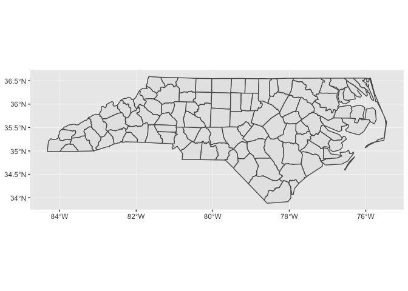
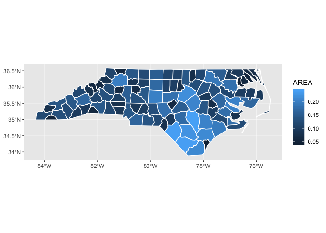
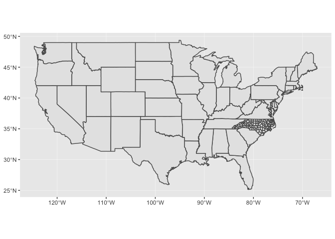
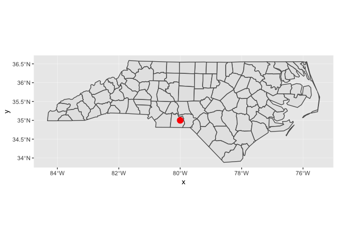
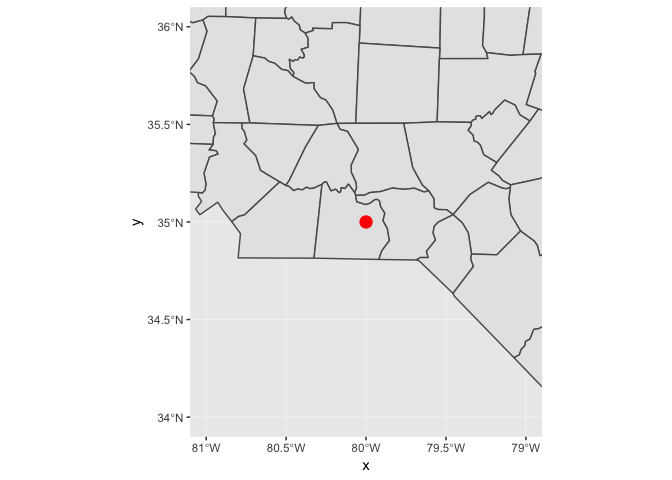
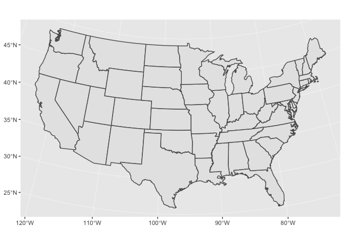

<!-- Generated automatically from spatial-vis.yml. Do not edit by hand -->

# Spatial visualization <small class='visualize'>[visualize]</small>
<small>(Builds on: [Spatial basics](spatial-basics.md))</small>


Setup
-----

We'll start by loading the tidyverse, sf, and read in a couple of sample datasets.

``` r
library(tidyverse)
library(sf)

nc <- read_sf(system.file("shape/nc.shp", package = "sf"))
states <- st_as_sf(maps::map("state", plot = FALSE, fill = TRUE))
```

`geom_sf()`
-----------

The easiest way to get started is to supply an sf object to `geom_sf()`:

``` r
ggplot() +
  geom_sf(data = nc)
```



Notice that ggplot2 takes care of setting the aspect ratio correctly.

You can supply other aesthetics: for polygons, `fill` is most useful:

``` r
ggplot() +
  geom_sf(aes(fill = AREA), data = nc, color = "white")
```



When you include multiple layers, ggplot2 will take care of ensuring that they all have a common coordinate reference system (CRS) so that it makes sense to overlay them.

``` r
ggplot() +
  geom_sf(data = states) + 
  geom_sf(data = nc)
```



You can combine `geom_sf()` with other geoms. In this case, `x` and `y` positions are assumed be in the same CRS as the sf object (typically these will be longitude and latitude).

``` r
ggplot() +
  geom_sf(data = nc) +
  annotate(geom = "point", x = -80, y = 35, color = "red", size = 4)
```



`coord_sf()`
------------

You'll need to use `coord_sf()` for two reasons:

-   You want to zoom into a specified region of the plot by using `xlim` and `ylim`

    ``` r
    ggplot() +
      geom_sf(data = nc) +
      annotate(geom = "point", x = -80, y = 35, color = "red", size = 4) + 
      coord_sf(xlim = c(-81, -79), ylim = c(34, 36))
    ```

    

-   You want to override to use a specific projection. If you don't specify the `crs` argument, it just uses the one provided in the first layer. The following example uses the Albers Equal Area projection and the NAD83 datum, which has an EPSG code of 102003.

    ``` r
    ggplot() +
      geom_sf(data = states) +
      coord_sf(crs = st_crs(102003))
    ```

    

